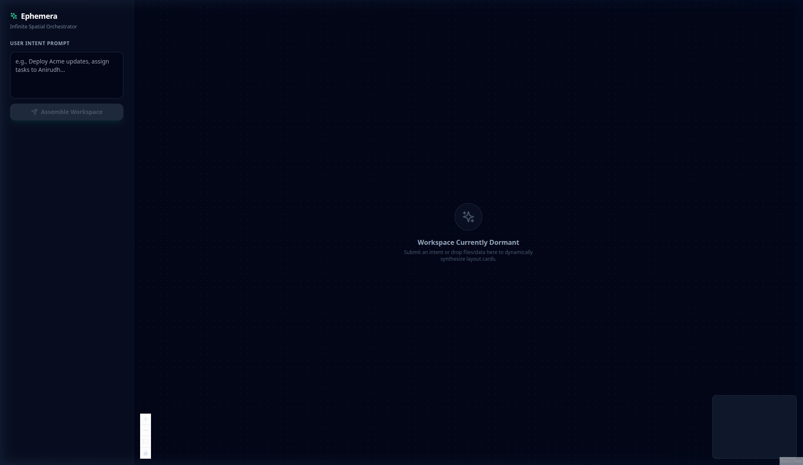
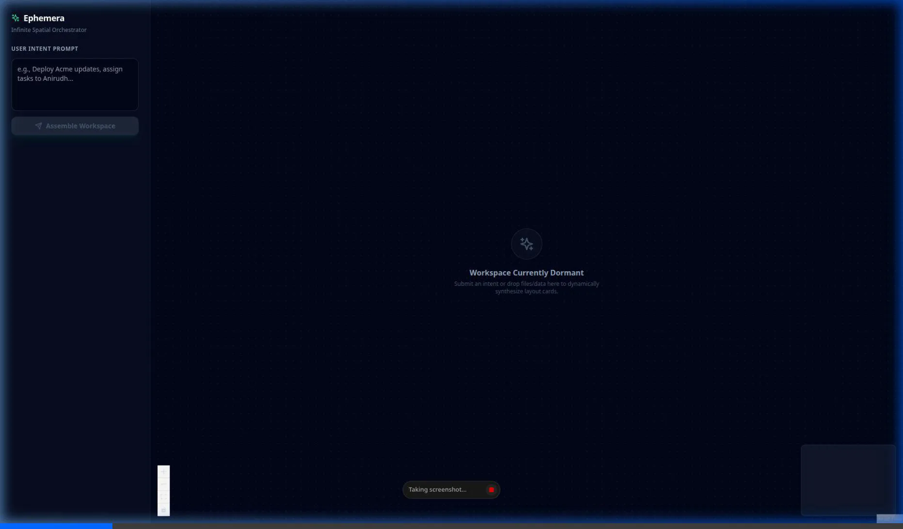
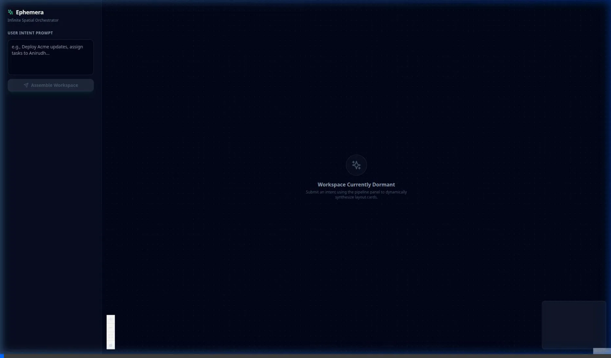

# OmniTrace: The Agentic Spatial Workspace

OmniTrace is an AI-native spatial reasoning environment designed to replace rigid, fragmented enterprise SaaS dashboards. It acts as a "Just-In-Time" Generative UI canvas where autonomous agents build the software interface dynamically around the user's specific intent.

Built on top of Google Antigravity 2.0, OmniTrace orchestrates a swarm of specialized AI agents to parse multimodal data, map logical dependencies on an infinite 2D plane, and proactively simulate execution risks before they hit production.

## The Paradigm Shift

Modern engineering and IT workflows are crippled by cognitive overload and software sprawl. Resolving a single incident often requires cross-referencing logs, tickets, and communication platforms manually. Furthermore, current AI assistants suffer from context amnesia and act as "yes-men," blindly executing commands without evaluating systemic risks.

OmniTrace shifts the paradigm from Conversational Chatbots to a Spatial Reasoning Environment:

- **No predefined dashboards**: The UI exists only for the duration of the task.
- **No linear text walls**: Information is mapped spatially so the human brain can process dependencies instantly.
- **No blind execution**: An adversarial safety agent reviews all proposed actions before they run.

## Maximum Capabilities & Feature Set

### 1. Dynamic Generative UI (GenUI)
- **Just-In-Time Micro-Frontends**: Instead of returning text, OmniTrace generates interactive React Flow components (Data Cards, Action Forms, Warning Nodes) tailored exactly to the data ingested.
- **Ephemeral Tooling**: Once a task is resolved, the specific UI cluster dissolves, eliminating software bloat and visual clutter.

### 2. Native Multimodal Ingestion
- **Drag-and-Drop Canvas**: Users can drag raw server logs, architecture diagrams, and error screenshots directly onto the coordinate plane.
- **Automated Root-Cause Parsing**: The Ingestion Agent instantly reads the dropped files and spawns a connected graph of nodes detailing the system state and the failure points.

### 3. Contextual Version Control (Anti-Amnesia)
- **Spatial Branching**: OmniTrace treats AI memory like a Git repository. Every follow-up query sprouts a new branch of visual nodes on the canvas.
- **Logic Rollbacks**: If an investigative path reaches a dead end, users simply pan the camera back to an earlier node and ask a new question, preserving the entire historical context without having to start a new chat.

### 4. The Adversarial Sandbox (Proactive Friction)
- **Simulated Stress Testing**: Before a user deploys a fix (e.g., restarting a database), they click "Simulate."
- **Hostile Peer Review**: An independent QA/Adversarial agent reviews the proposed fix against the entire canvas context. If it detects a safety risk, it injects bright red Warning Nodes directly onto the execution path, forcing the user to acknowledge the blind spot before proceeding.
- **Provable Safety**: Instead of blind execution, the platform generates verifiable artifacts—such as task lists, implementation plans, and security checks—before touching live systems.

### 5. Enterprise Data Grounding via Model Context Protocol (MCP)
OmniTrace leverages Google Antigravity's native Model Context Protocol support to connect directly to enterprise data without custom API development. The maximum integration footprint includes:
- **Source Code & CI/CD**: Native context ingestion from GitLab Orbit to analyze blast radius, merge requests, and vulnerabilities.
- **Data Cloud Integration**: Direct querying of Google Cloud services like BigQuery and AlloyDB for PostgreSQL to validate application logic against live data.
- **Workspace Communication**: Secure connections to Google Workspace (Drive, Docs, Chat) to pull internal documentation or draft automated incident reports.

## System Architecture
OmniTrace utilizes a stateless, agent-orchestrated architecture:

| Layer | Technology | Function |
|-------|------------|----------|
| **Orchestrator** | Google Antigravity 2.0 | Acts as the central command center, launching and managing parallel specialized agents (Ingestion, Logic, QA). |
| **Intelligence** | Gemini 2.5 Flash | Delivers high-speed, multimodal reasoning with strict JSON schema enforcement for the frontend. |
| **Data Bridge** | Model Context Protocol (MCP) | Serves as the universal translator, securely connecting the local LLM to external databases and local file systems. |
| **Frontend UI** | React Flow & TypeScript | Renders the infinite 2D canvas, handling spatial mathematics, drag-and-drop physics, and dynamic component injection. |

## Local Development & Setup

### Prerequisites
- Node.js (v18+)
- Google Antigravity 2.0 Desktop Application
- Gemini API Key (Configured in Antigravity)

### 1. Frontend Canvas Initialization
Navigate to the project root and start the React Flow workspace:
```bash
npm install
npm run dev
```

### 2. Antigravity Orchestration Setup
OmniTrace relies on Antigravity for backend processing and MCP routing rather than a traditional Python server.
- Open the Google Antigravity application and load the OmniTrace directory as your active Workspace.
- Open the MCP Store within Antigravity settings and configure your local data sources (e.g., local filesystem, standard database connections).
- Open the Manager View to initialize the Swarm Protocol.
- Provide the root directive: `"Monitor the OmniTrace React canvas state. Parse all dropped files, generate UI schema nodes via JSON, and run the Adversarial Sandbox protocol on all execution requests."`

### 3. Usage
- Open `http://localhost:5173` in your browser.
- Drag a text file containing an error log directly onto the canvas.
- Watch the Antigravity agents autonomously parse the data and build your visual workspace.

## Workflow Samples

### 1. Dormant Canvas State


### 2. Intelligent Data Ingestion


### 3. Agentic Workflow Execution

